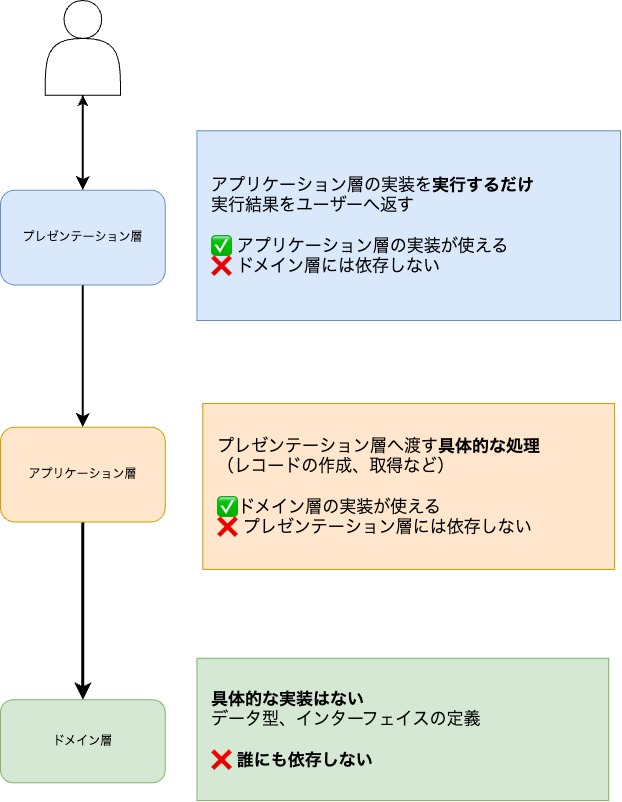

# 推測しやすいコードを書こう

**自己流でコードを分けないための考え方**

2024-12-14 Kawaii♡LT

**ふみふみ（[2323-code](https://github.com/2323-code)）**


X: [@2323_code](https://x.com/2323_code)

---

# 目次

- 対象者
- 結論
- なぜ自己流でコードを分けてはいけないのか
- 分ける基準が分からない、どうすれば？
- まとめ

---

## この LT の対象者

- 自分だけで実装を書いたはずなのに、どこにどの実装があるかわからなくなった覚えのある人
- 修正の影響範囲が分からず、不安になったことがある人
- 設計とか考えてはじめからコード書けるようになりたい人

---

## つまり

### 推測しづらいコードを書いた覚えがある人

を、対象者としています。

---

## 結論：推測しやすいコードを書くためには？

自己流でコードを分けないために何ができる？

- 既存の概念から考えよう
  - 三層アーキテクチャ
  - どの層にどのようなコードを書くかを考えて書こう
- 既存の概念を使うことで、自分も他人も推測しやすいコードを書くことができる

---

## Q. なぜ自己流でコードを分けてはいけないのか

### A. 推測しづらいコードになるから。

- 変更の影響範囲が分かりづらい
- 役割がはっきりしない
  - → どこに何があるかが分かりづらい

---

## 自己流でコードを分けるとは？

### 😇 過去の自分のやらかし

---

### ① 実質 main 関数に全てのロジックを書いている

😇 < 分けてる 「つもり」

```python
# main.py

def main():
    main_logic()

def main_logic():
    # ロジック1
    # ロジック2
    # ロジック3...
```

---

### ② ロジックの一部を分ける基準が曖昧

😇 < 重複は避けたい！でも内容が若干違うので結局ベタがき...

```python

def ロジックA():
    # ロジック1

def ロジックB():
    # ロジック1' # ほぼ重複
```

---

## Q. 分ける基準が分からない、どうすれば？

## A. 既存の概念から考えよう

- 三層アーキテクチャ

層に分けると、コードを分ける基準が見えてくる

---

## 三層アーキテクチャとは

---



---

### ① ロジックを main 関数に全て書かない

👍 < メソッドの入出力はインターフェイスで定義、詳細はアプリケーション層で記述！

```python
# main.py
main()

# presentation.py
def main():
    main_logic()


# application.py
def main_logic(id: int) -> str:
    return f"ID: {id}"

# domain.py
def main_logic(id: int) -> str:
    return NotImplementedError

```

---

### ② ロジックの一部を分ける基準を明確にする

👍 < 内容が若干違くても、同じメソッドを呼べば済むように書く!

```python

# main.py
main()

# presentation.py
def main(greeter: Greeter):
    print(greeter.greet())

    if user == "A":
        greeter = GreetA()
    else:
        greeter = GreetB()

# application.py

class GreetA(Greeter):
    def greet(self) -> str:
        return "Hello A!"

class GreetB(Greeter):
    def greet(self) -> str:
        return "こんにちは B!"

# domain.py
class Greeter:
  def greet(self) -> str:
      return NotImplementedError

```

---

## 結論：推測しやすいコードを書くためには？

自己流でコードを分けないために何ができる？

- 既存の概念から考えよう
  - 三層アーキテクチャ
  - どの層にどのようなコードを書くかを考えて書こう
- 既存の概念を使うことで、自分も他人も推測しやすいコードを書くことができる

---

## 参考文献

- [現場で役立つシステム設計の原則 〜変更を楽で安全にするオブジェクト指向の実践技法](https://gihyo.jp/book/2017/978-4-7741-9087-7)

  - 増田亨　著
  - 技術評論社

- [MVC、3 層アーキテクチャから設計を学び始めるための基礎知識 #初心者 - Qiita](https://qiita.com/os1ma/items/7a229585ebdd8b7d86c2)
  - 2024/12/13 最終閲覧
- [やさしいクリーンアーキテクチャ](https://zenn.dev/sre_holdings/articles/a57f088e9ca07d)
  - 2024/12/13 最終閲覧

---

# 🙌 ご清聴ありがとうございました！ ☺️

`#KawaiiLT` で感想をお待ちしております！


X: [@2323_code](https://x.com/2323_code)
